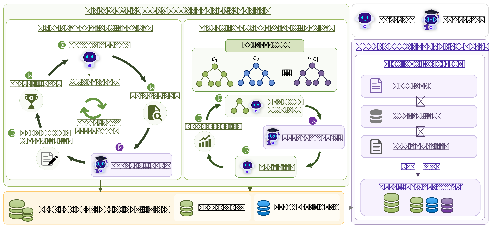

<div align="center">

</div>

# MASA: Model-Aware Skill Alignment for LLM Agents

<div align="center">

**Aligning skill formulations with each target backbone's capacity through hierarchical model-conditioned evolution.**

[](https://arxiv.org/abs/2605.30723)
[](LICENSE)

</div>

<p align="center">

</p>

## 🔥 News

- **[06/2026]** Code for MASA is released!
- **[05/2026]** MASA paper is released on [arXiv](https://arxiv.org/abs/2605.30723).

## 📖 Overview

Existing skill-library systems construct a single shared library and reuse it across different LLM backbones. However, we empirically show that **a skill that boosts one backbone can actively degrade another** — the optimal skill formulation depends on the target model's capacity.

**MASA** (**M**odel-**A**ware **S**kill **A**lignment) addresses this by aligning skill formulations with each target backbone without modifying agent weights. It treats skill alignment as a hierarchical search problem driven by environment feedback:

1. **Hierarchical Model-Conditioned Skill Evolution**: A teacher LLM iteratively rewrites skills conditioned on a structured *model card*, using hill-climbing for general skills and UCB-driven tree search for task-specific skills.

2. **Model-Conditioned Skill Rewriter (MASA-Rewriter)**: A lightweight Qwen3-4B model trained to replicate the evolution pipeline's rewriting policy, enabling skill adaptation in a single forward pass without environment interaction.

### Key Results

- Achieves the highest success rate across **3 environments** (ALFWorld, WebShop, Search) and **4 Qwen3 backbones** (4B–32B)
- Up to **+25.8** points improvement over the strongest baseline (Qwen3-8B on ALFWorld)
- MASA-Rewriter (4B) outperforms DeepSeek-V4-Pro teacher at negligible cost
- Generalizes to unseen tasks and environments in a single forward pass

---

## 📥 Supported Models

<table>
  <thead>
    <tr>
      <th align="center">Backbone</th>
      <th align="center">Parameters</th>
      <th align="center">Model Card</th>
    </tr>
  </thead>
  <tbody>
    <tr>
      <td align="center"><a href="https://huggingface.co/Qwen/Qwen3-4B">Qwen3-4B</a></td>
      <td align="center">4B</td>
      <td align="center"><code>model_cards/qwen3_4b.yaml</code></td>
    </tr>
    <tr>
      <td align="center"><a href="https://huggingface.co/Qwen/Qwen3-8B">Qwen3-8B</a></td>
      <td align="center">8B</td>
      <td align="center"><code>model_cards/qwen3_8b.yaml</code></td>
    </tr>
    <tr>
      <td align="center"><a href="https://huggingface.co/Qwen/Qwen3-14B">Qwen3-14B</a></td>
      <td align="center">14B</td>
      <td align="center"><code>model_cards/qwen3_14b.yaml</code></td>
    </tr>
    <tr>
      <td align="center"><a href="https://huggingface.co/Qwen/Qwen3-32B">Qwen3-32B</a></td>
      <td align="center">32B</td>
      <td align="center"><code>model_cards/qwen3_32b.yaml</code></td>
    </tr>
  </tbody>
</table>

Embedding model for skill retrieval: [Qwen3-Embedding-0.6B](https://huggingface.co/Qwen/Qwen3-Embedding-0.6B)

---

## 🚀 Getting Started

### Installation

```bash
git clone https://github.com/your-org/MASA.git
cd MASA

pip install -e .
pip install vllm==0.11.0
pip install flash-attn==2.7.4.post1 --no-build-isolation --no-cache-dir
pip install openai
```

### Environment Setup

**ALFWorld**
```bash
pip install alfworld
pip install gymnasium==0.29.1
pip install stable-baselines3==2.6.0

# Download PDDL & Game files and pre-trained MaskRCNN detector
alfworld-download -f
```

**WebShop**
```bash
cd agent_system/environments/env_package/webshop/webshop
./setup.sh -d all
```

**Search**
```bash
cd agent_system/environments/env_package/search/third_party
pip install -e .
pip install gym==0.26.2
```

### Download Models

Place model weights under a `./model/` directory (or modify paths in scripts):

```
model/
├── Qwen3-4B/
├── Qwen3-8B/
├── Qwen3-14B/
├── Qwen3-32B/
└── Qwen3-Embedding-0.6B/
```

### Download Search Data

For the Search environment, download the retrieval index and corpus:

```bash
python examples/search/searchr1_download.py
```

This downloads the wiki-18 index and corpus from HuggingFace to `./data/searchR1/`.

---

## 🏃 Evaluation with MASA Skills

### ALFWorld

```bash
# Edit MODEL_SIZE (4b/8b/14b/32b) and SKILL_JSON as needed
bash scripts/run_alfworld.sh
```

### WebShop

```bash
bash scripts/run_webshop.sh
```

### Search

First, start the retrieval server:
```bash
bash scripts/start_retrieval_server.sh
```

Then run evaluation:
```bash
bash scripts/run_search.sh
```

### Configuring Model Size

Each script supports switching model sizes:
```bash
MODEL_SIZE="8b"   # Options: 4b, 8b, 14b, 32b
```

The corresponding MASA skill file is selected via:
```bash
SKILL_JSON="./memory_data/<env>/<size>_masa_skills.json"
```

---

## 📋 Skill Bank Structure

### Available Skill Variants

Each environment provides multiple skill formulations for comparison:

| File Pattern | Description |
|---|---|
| `<size>_masa_skills.json` | **MASA** — Model-aware evolved skills (our method) |
| `<size>_adapter_skills.json` | **DS-Adapter** — One-shot teacher rewrite baseline |
| `base_skills.json` | **Base Skill** — Shared model-agnostic skills (from SkillRL) |
| `noskill.json` | No-skill control |


---

## 📚 Citation

If you find our work helpful, please consider citing:

```bibtex
@article{yu2026skill,
  title={Skill is Not One-Size-Fits-All: Model-Aware Skill Alignment for LLM Agents},
  author={Yu, Jianxiang and Zhu, Jiapeng and Lin, Bochen and Cui, Qier and Ding, Zichen and Li, Xiang},
  journal={arXiv preprint arXiv:2605.30723},
  year={2026}
}
```

## 🙏 Acknowledgement

We thank the open-source community and the following projects for making this work possible:
[verl](https://github.com/volcengine/verl), [verl-agent](https://github.com/langfengQ/verl-agent), [SkillRL](https://github.com/aiming-lab/SkillRL), [Qwen](https://github.com/QwenLM/Qwen), [ALFWorld](https://github.com/alfworld/alfworld), [WebShop](https://github.com/princeton-nlp/WebShop).
